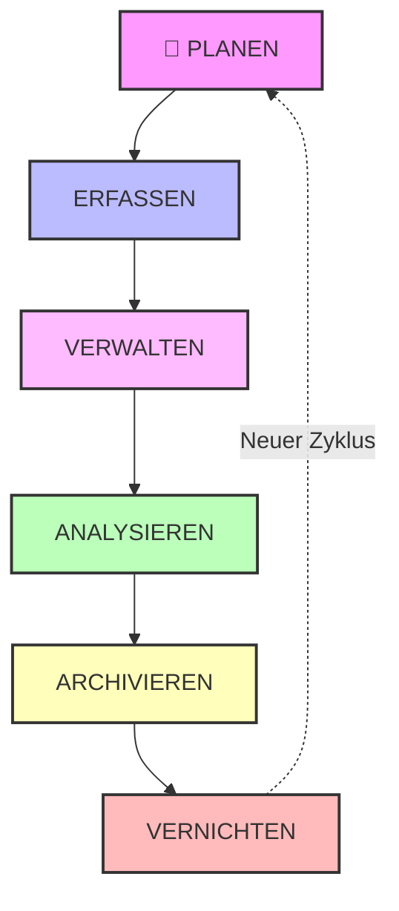
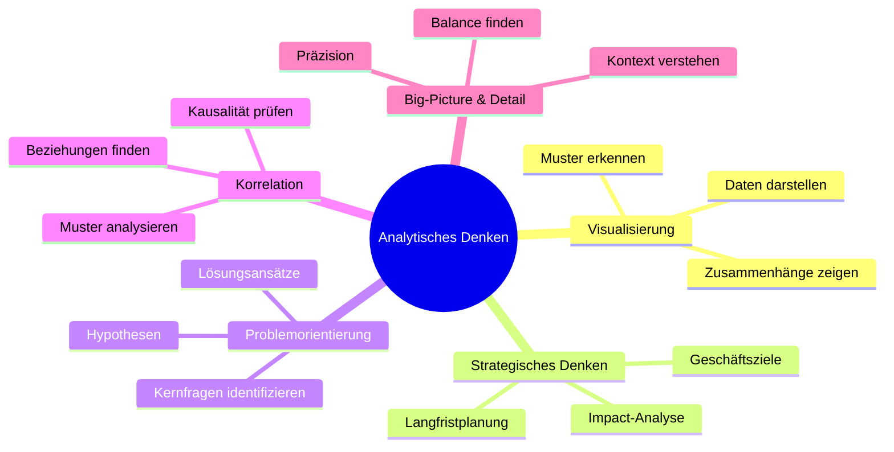

---

##  Die 6 Phasen der Datenanalyse

###  **FRAGEN (Ask)**

> Das Problem definieren und verstehen

**Definition Problem:** Die Diskrepanz zwischen aktuellen Zustand und dem idealen Zustand.
Das bedeutet, dass ein Problem entsteht, wenn die Realität nicht den
Erwartungen oder Zielen entspricht, die wir haben.

**🧠 Analytisches Denken:**

- Strategisches Denken: Geschäftsziele verstehen
- Problemorientierung: Kernfrage identifizieren  
- Big-Picture: Kontext erfassen

**Strukturiertes Denken ist der Prozess bei dem:**

- aktuelle Probleme
- aktuelle Situationen
- Lücken - und Chancen
- Optionen

erkannt oder identifiziert werden. In diesem Prozess gehen Sie ein vages oder
komplexes Problem an, indem Sie es in kleinere Schritte unterteilen und diese
zur einer logischen Lösung führen.

**🎯 Aktivitäten:**

- Stakeholder-Interviews durchführen:
  - **Geschäftsziele verstehen** --> 5 Warum Strategie verwenden!
- Iterative Reporting und  Stakeholder Feedbacks einholen um sicherzustellen das die Erwartungen erfüllt werden
- SMART-Ziele definieren [[Glossar-Grundlagen-Modul-2]]
- Erfolgskriterien festlegen
- Hypothesen formulieren

---

###  **VORBEREITEN (Prepare)**
>
> Daten sammeln und organisieren

**🧠 Analytisches Denken:**

- Detail-orientiert: Datenquellen prüfen
- Korrelation: Zusammenhänge erkennen
- Datengesteuert: Relevanz bewerten

**📦 Aktivitäten:**

- Datenquellen identifizieren
- Daten sammeln/extrahieren
- Speicherort festlegen
- Datenschutz sicherstellen

---

###  **VERARBEITEN (Process)**
>
> Daten bereinigen und transformieren

**🧠 Analytisches Denken:**

- Detail-orientiert: Fehler identifizieren
- Visualisierung: Muster in Rohdaten erkennen
- Systematisch: Qualitätskontrolle durchführen

**🧹 Aktivitäten:**

- Duplikate entfernen
- Fehler korrigieren
- Formate standardisieren
- Validierung durchführen

---

###   **ANALYSIEREN (Analyze)**
>
> Erkenntnisse aus den Daten gewinnen

**🧠 Analytisches Denken:**

- Korrelation: Beziehungen finden
- Datengesteuert: Objektive Analyse
- Design-Thinking: Kreative Ansätze

**🔍 Aktivitäten:**

- Statistische Analysen durchführen
- Trends identifizieren
- Muster erkennen
- Hypothesen testen

---

###  **TEILEN (Share)**
>
> Ergebnisse kommunizieren

**🧠 Analytisches Denken:**

- Visualisierung: Daten anschaulich darstellen
- Strategisch: Story erzählen
- Big-Picture: Kontext liefern

**📈 Aktivitäten:**

- Dashboards erstellen
- Präsentationen vorbereiten
- Reports schreiben
- Visualisierungen gestalten

---

###   **HANDELN (Act)**
>
> Empfehlungen umsetzen

**🧠 Analytisches Denken:**

- Problemorientiert: Lösungen umsetzen
- Strategisch: Impact messen
- Iterativ: Kontinuierlich verbessern

**🚀 Aktivitäten:**

- Maßnahmen implementieren
- Ergebnisse überwachen
- Feedback sammeln
- Prozess optimieren

---

 

## ♻️ Datenlebenszyklus

### Phasen im Detail

| Phase             | Beschreibung                            | Verbindung zum Analyseprozess |
| ----------------- | --------------------------------------- | ----------------------------- |
| **PLANEN**      | Entscheidung über zu erfassende Daten   | → Phase 1: FRAGEN             |
| **ERFASSEN**    | Datensammlung aus verschiedenen Quellen | → Phase 2: VORBEREITEN        |
| **VERWALTEN**   | Sicherstellung der Datenintegrität      | → Phase 3: VERARBEITEN        |
| **ANALYSIEREN** | Verwendung zur Problemlösung            | → Phase 4: ANALYSIEREN        |
| **ARCHIVIEREN** | Langzeitspeicherung                     | → Nach Phase 6: HANDELN       |
| **VERNICHTEN**  | Sichere Löschung nicht benötigter Daten | → Datenschutz & Compliance    |

---

 

##  Arten des Analytischen Denkens

---

## 🔗 Verbindungen zwischen den Konzepten

### Analyseprozess  <--> Datenlebenszyklus

- **Parallel verlaufend:** Während du den 6-Phasen-Prozess durchläufst, bewegen sich die Daten durch ihren eigenen Lebenszyklus
- **Synchronisationspunkte:** Besonders bei VORBEREITEN/ERFASSEN und VERARBEITEN/VERWALTEN

### Analytisches Denken als Querschnittskompetenz

- **Durchgängig erforderlich:** Jede Phase erfordert spezifische kognitive Fähigkeiten
- **Adaptiv:** Die Art des Denkens passt sich der jeweiligen Phase an

---

## 📚 Weiterführende Notizen

- [[Fragephase]] - Detaillierte Anleitung zur Problem-Definition
- [[Vorbereitungsphase]] - Datensammlung Best Practices
- [[Verarbeitungsphase]] - Datenbereinigung Techniken
- [[Analyse-Phase]] - Statistische Methoden
- [[Phase der Weitergabe]] - Visualisierung & Storytelling
- [[Handlungsphase]] - Implementation & Monitoring

---

