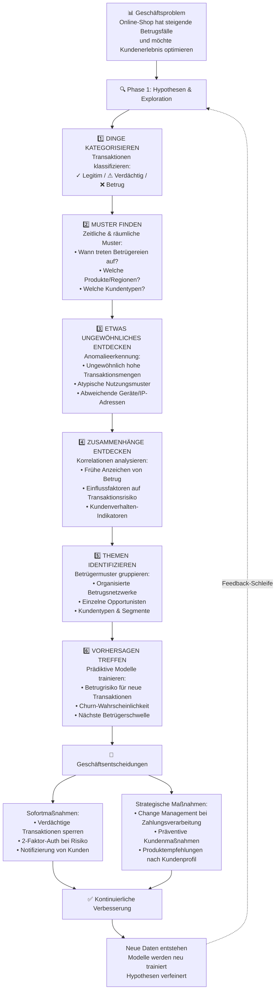

---

```mermaid
graph TD
    A["📊 Geschäftsproblem<br/>Online-Shop hat steigende Betrugsfälle<br/>und möchte Kundenerlebnis optimieren"] --> B["🔍 Phase 1: Hypothesen & Exploration"]
    
    B --> C["1️⃣ DINGE KATEGORISIEREN<br/>Transaktionen klassifizieren:<br/>✓ Legitim / ⚠ Verdächtig / ❌ Betrug"]
    
    C --> D["2️⃣ MUSTER FINDEN<br/>Zeitliche & räumliche Muster:<br/>• Wann treten Betrügereien auf?<br/>• Welche Produkte/Regionen?<br/>• Welche Kundentypen?"]
    
    D --> E["3️⃣ ETWAS UNGEWÖHNLICHES ENTDECKEN<br/>Anomalieerkennung:<br/>• Ungewöhnlich hohe Transaktionsmengen<br/>• Atypische Nutzungsmuster<br/>• Abweichende Geräte/IP-Adressen"]
    
    E --> F["4️⃣ ZUSAMMENHÄNGE ENTDECKEN<br/>Korrelationen analysieren:<br/>• Frühe Anzeichen von Betrug<br/>• Einflussfaktoren auf Transaktionsrisiko<br/>• Kundenverhalten-Indikatoren"]
    
    F --> G["5️⃣ THEMEN IDENTIFIZIEREN<br/>Betrügermuster gruppieren:<br/>• Organisierte Betrugsnetzwerke<br/>• Einzelne Opportunisten<br/>• Kundentypen & Segmente"]
    
    G --> H["6️⃣ VORHERSAGEN TREFFEN<br/>Prädiktive Modelle trainieren:<br/>• Betrugrisiko für neue Transaktionen<br/>• Churn-Wahrscheinlichkeit<br/>• Nächste Betrügerschwelle"]
    
    H --> I["💼 Geschäftsentscheidungen"]
    
    I --> J["Sofortmaßnahmen:<br/>• Verdächtige Transaktionen sperren<br/>• 2-Faktor-Auth bei Risiko<br/>• Notifizierung von Kunden"]
    
    I --> K["Strategische Maßnahmen:<br/>• Change Management bei Zahlungsverarbeitung<br/>• Präventive Kundenmaßnahmen<br/>• Produktempfehlungen nach Kundenprofil"]
    
    J --> L["✅ Kontinuierliche Verbesserung"]
    K --> L
    
    L --> M["Neue Daten entstehen<br/>Modelle werden neu trainiert<br/>Hypothesen verfeinert"]
    
    M -.->|Feedback-Schleife| B

```

---
