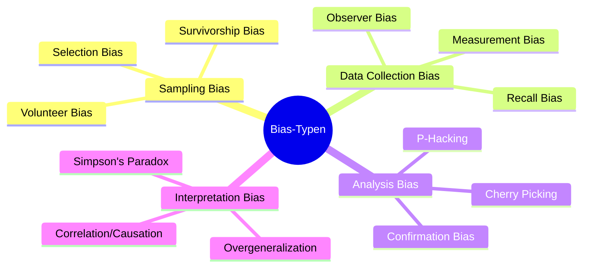

# ⚖️ Fairness & Ethics in Data Analytics - Map of Content

> **Zentrale Übersicht über Fairness, Bias und ethische Datenanalyse**

---

## 🎯 Kernkonzepte

### Was ist Fairness in der Datenanalyse?
- [[Fairness]]
- [[Fairness berücksichtigen]]
- [[Bias-Bewusstsein]]

---

## 🔄 Fairness im Datenanalyse-Prozess

### Übersicht
[[Fairness Prozess während der Phasen der Datenanalyse]]

```dataview
TABLE WITHOUT ID
  file.link as "Fairness-Themen",
  tags as "Tags"
FROM #fairness
WHERE file.folder = this.file.folder OR contains(file.path, "1.4 Werden Sie zu einem fairen")
SORT file.name ASC
```

### Phase-spezifische Fairness

#### 1. 📊 Datenakquise
**[[Fairness in der Datenakquise]]**

**Zentrale Fragen:**
- Bewusstsein für Bias während der Datenakquise entwickeln
- Vielfältige Datenquellen nutzen
- Repräsentativität sicherstellen

**Best Practices:**
```dataview
TABLE WITHOUT ID
  file.link as "Best Practice"
FROM [[Fairness in der Datenakquise]]
WHERE file.name != "Fairness in der Datenakquise"
```

#### 2. 🧹 Datenaufbereitung
**Kernthemen:**
- Datenbereinigung ohne Bias
- Faire Kategorisierung
- Umgang mit fehlenden Werten

#### 3. 🔍 Datenanalyse
**[[Statistische Untersuchung von Daten]]**

**Wichtige Checks:**
- Bias-Tests durchführen
- Kontext berücksichtigen
- Subgruppen-Analysen

```dataview
TABLE WITHOUT ID
  file.link as "Statistische Themen"
FROM [[Statistische Untersuchung von Daten]] OR outgoing([[Statistische Untersuchung von Daten]])
SORT file.name ASC
```

#### 4. 📈 Interpretation & Visualisierung
**Kernthemen:**
- Ethische Visualisierung
- Transparente Kommunikation
- Vorsicht bei Schlussfolgerungen

#### 5. 🚀 Präsentation & Umsetzung
**Kernthemen:**
- Stakeholder einbeziehen
- Diverse Perspektiven berücksichtigen
- Feedback-Schleifen

---

## 📋 Praktische Werkzeuge

### Checklisten
[[Fairness Best Practice und Checkliste]]

**Fairness-Checkliste:**

```dataview
LIST
FROM [[Fairness Best Practice und Checkliste]]
WHERE contains(file.outlinks, this.file.link)
```

### Best Practice Ansätze

**5-Schritte-Methode:**
1. Ziel-Population definieren
2. Relevante Dimensionen identifizieren
3. Stratified Sampling nutzen
4. Mehrere Datenquellen kombinieren
5. Limitationen dokumentieren

---

## 🧠 Bias verstehen

### Arten von Bias



### Bias-Bewusstsein als "Big Picture"-Ansatz

**[[Bias-Bewusstsein]]**

**Drei Ebenen:**
- **Mikro:** Daten selbst
- **Meso:** Analyse-Prozess
- **Makro:** Gesellschaftlicher Impact

---

## ⚠️ Warnsignale für unfaire Datensätze

```dataview
TABLE WITHOUT ID
  "❌ " + rows.text as "Warnsignal"
FROM ""
WHERE contains(file.link, [[Fairness Best Practice und Checkliste]])
FLATTEN list("Convenience Sampling", "Nur freiwillige Teilnahme", "Homogene Datenquelle", "Historische Daten ohne Prüfung", "Fehlende Dokumentation") as text
```

**Konkrete Warnsignale:**
- ❌ Convenience Sampling
- ❌ Nur freiwillige Teilnahme ohne Strategie
- ❌ Sehr homogene Datenquelle
- ❌ Historische Daten ohne kritische Prüfung
- ❌ Fehlende Dokumentation über Erhebungsmethode

---

## 💡 Praxisbeispiele

### Real-World Cases

**Positive Beispiele:**
- Stratified Sampling für Kundenbefragungen
- Multiple Kanäle für Datenerhebung
- Bias-Audits vor Modell-Deployment

**Negative Beispiele (Lessons Learned):**
- Amazon KI-Recruiting-Tool (Gender Bias)
- Facial Recognition (Racial Bias)
- Credit Scoring (Socioeconomic Bias)

---

## 📚 Verbindung zu Analytischem Denken

### Fairness + Analytisches Denken

**[[Analytisches Denken]]** erweitert um Bias-Bewusstsein:

- ✓ Probleme in Einzelteile zerlegen
- ✓ Muster erkennen
- ✓ Logisch denken
- **+ Kontext beachten**
- **+ Fairness berücksichtigen**
- **+ Langfristige Auswirkungen einbeziehen**
- **+ Diverse Perspektiven einbinden**

= **Verantwortungsvolle Datenanalyse** 🎯

---

## 🎯 Konkrete Techniken

### Minimum Sample Size
- Faustregel: 30-50 Datenpunkte pro Subgruppe
- Bei kleineren Gruppen: Oversampling

### Bias-Audits
- Vergleich mit offiziellen Statistiken
- Repräsentativitäts-Metriken berechnen

### Team-Diversität
- Verschiedene Perspektiven erkennen unterschiedliche Bias-Quellen

---

## 🔗 Verbindungen

### Zu anderen MOCs
- [[📋 Data Analysis Process MOC]] - Integration in den Prozess
- [[📊 Tools & Techniken MOC]] - Technische Umsetzung
- [[📖 Grundlagen MOC]] - Theoretische Basis

### Zu Glossaren
```dataview
LIST
FROM "5. Anhang"
WHERE contains(file.name, "Glossar")
SORT file.name ASC
```

---

## 📈 Relevante Ressourcen

```dataview
TABLE WITHOUT ID
  file.link as "Ressource",
  date as "Datum",
  tags as "Tags"
FROM #fairness OR #bias OR #ethics
WHERE file.folder != this.file.folder
SORT date DESC
```

---

## ✅ Fairness Action Items

**Vor jedem Projekt prüfen:**
- [ ] Ist meine Datenquelle repräsentativ?
- [ ] Habe ich diverse Quellen berücksichtigt?
- [ ] Sind alle relevanten Gruppen vertreten?
- [ ] Habe ich Limitationen dokumentiert?
- [ ] Funktioniert meine Analyse für alle Subgruppen?
- [ ] Habe ich ethische Implikationen berücksichtigt?

---

## 📖 Weiterführende Themen

### Zu vertiefen:
- [ ] Algorithmic Fairness
- [ ] Differential Privacy
- [ ] Explainable AI (XAI)
- [ ] Data Ethics Frameworks
- [ ] GDPR & Datenschutz

---

*Letzte Aktualisierung: 2025-10-14*

---

> 💡 **Merke:** Fairness ist kein einmaliger Check, sondern ein kontinuierlicher Prozess durch alle Phasen der Datenanalyse!
