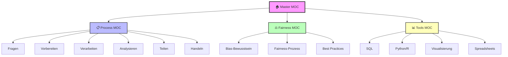

# 🏠 Data Analytics Knowledge Base - Home

> **Willkommen zu deiner persönlichen Data Analytics Wissensdatenbank!**
> Zentrale Anlaufstelle für alle Themen rund um Datenanalyse

---

## 🗺️ Haupt-MOCs (Maps of Content)

```dataview
TABLE WITHOUT ID
  file.link as "📋 MOC",
  date as "Erstellt",
  choice(contains(lower(file.name), "process"), "🔄", choice(contains(lower(file.name), "fairness"), "⚖️", choice(contains(lower(file.name), "tools"), "🛠️", "📚"))) as "Icon"
FROM "3. MOCs"
WHERE file.name != this.file.name
SORT file.name ASC
```

### 🎯 Die 3 Säulen deiner Knowledge-Base

| MOC | Fokus | Nutzen |
|-----|-------|--------|
| [[📋 Data Analysis Process MOC]] | 6-Phasen-Prozess | Strukturiertes Vorgehen bei Projekten |
| [[⚖️ Fairness & Ethics MOC]] | Bias & Ethik | Verantwortungsvolle Analysen |
| [[📊 Tools & Techniken MOC]] | Werkzeuge & Skills | Technische Umsetzung |

---

## 📚 Kurs-Struktur: Google Data Analytics

### Modul 1: Grundlagen ✅
[[Grundlagen]]

```dataview
TABLE WITHOUT ID
  file.link as "Lektion",
  tags as "Tags"
FROM "1. Google Data Analytics/1.0 Grundlagen"
WHERE file.name != "Grundlagen"
SORT file.folder ASC, file.name ASC
LIMIT 10
```

**Wichtige Konzepte:**
- [[Analytisches Denken]] - Die 5 Säulen
- [[Datenanalyse-Prozess-Übersicht]] - Visualisierungen
- [[Lebenszyklus von Daten]] - Data Lifecycle
- [[Data-Driven Decision Making]] - Datenbasierte Entscheidungen

---

### Modul 2-9: Weitere Kurse 🚧

```dataview
TABLE WITHOUT ID
  file.folder as "Modul",
  length(file.outlinks) as "# Notizen"
FROM "1. Google Data Analytics"
WHERE file.folder != "1. Google Data Analytics/1.0 Grundlagen"
GROUP BY file.folder
SORT file.folder ASC
```

**Status:**
- ✅ Modul 1: Grundlagen (Abgeschlossen)
- 🚧 Modul 2-9: In Arbeit

---

## 🎯 Quick Access - Wichtigste Notizen

### 🔥 Meistgenutzte Konzepte

```dataview
TABLE WITHOUT ID
  file.link as "Notiz",
  length(file.inlinks) as "← Eingehende Links",
  length(file.outlinks) as "→ Ausgehende Links",
  choice(length(file.inlinks) > 10, "🔥", choice(length(file.inlinks) > 5, "⭐", "")) as "Relevanz"
FROM "1. Google Data Analytics"
WHERE file.name != "Grundlagen" AND length(file.inlinks) > 0
SORT length(file.inlinks) DESC
LIMIT 10
```

### 📋 Cheat Sheets

```dataview
TABLE WITHOUT ID
  file.link as "Cheat Sheet",
  date as "Erstellt"
FROM "5. Anhang/Cheat-Sheets"
SORT file.name ASC
```

**Schnellzugriff:**
- [[SQL-Cheat-Sheet]] - SQL Syntax & Commands
- [[Data-Visualization-Cheat-Sheet]] - Chart-Typen & Best Practices
- [[Spreadsheets-Cheat-Sheet]] - Excel/Sheets Funktionen

---

## 📊 Lernfortschritt

### Letzte 5 Updates

```dataview
TABLE WITHOUT ID
  file.link as "Fortschritt",
  date as "Datum",
  file.folder as "Kategorie"
FROM "6. Progress"
SORT date DESC
LIMIT 5
```

### Projekt-Protokolle

```dataview
LIST
FROM ""
WHERE contains(file.name, "Projektprotokoll")
SORT file.name DESC
```

---

## 🎓 Lernpfad & Roadmap

### Phase 1: Fundamentals (Aktuell) ✅
- [x] Datenanalyse-Prozess verstehen
- [x] Analytisches Denken entwickeln
- [x] Fairness & Bias Awareness
- [x] Grundlegende Tools kennen

### Phase 2: Technical Skills (In Arbeit) 🚧
- [ ] SQL beherrschen
- [ ] Data Cleaning mastern
- [ ] Visualisierung vertiefen
- [ ] Spreadsheet Advanced

### Phase 3: Advanced Analytics (Geplant) 📅
- [ ] Statistische Analysen
- [ ] R/Python Grundlagen
- [ ] Dashboard Design
- [ ] Capstone Projekt

---

## 📖 Ressourcen-Hub

### Best Practices
[[Best-Practices]]

### Glossare
```dataview
LIST
FROM "5. Anhang"
WHERE contains(file.name, "Glossar")
SORT file.name ASC
```

### Übungsaufgaben
```dataview
TABLE WITHOUT ID
  file.link as "Übung",
  tags as "Typ"
FROM "5. Anhang/Übungsaufgaben"
SORT file.name ASC
```

### Häufige Fehler
[[Häufige-Fehler]]

---

## 🔍 Themen-Tags

### Nach Konzept browsen

```dataview
TABLE WITHOUT ID
  rows.file.link as "Notizen"
FROM "1. Google Data Analytics"
FLATTEN file.tags as tag
WHERE tag
GROUP BY tag
SORT tag ASC
```

---

## 🌟 Featured: Fairness & Ethics

**Aktuelle Schwerpunkte:**
- [[Bias-Bewusstsein]] - Big Picture Ansatz
- [[Fairness in der Datenakquise]] - Repräsentative Daten
- [[Statistische Untersuchung von Daten]] - EDA für Fairness
- [[Fairness Best Practice und Checkliste]] - Praktische Tools

**Warum wichtig?**
> Fairness ist kein einmaliger Check, sondern ein kontinuierlicher Prozess durch alle Phasen der Datenanalyse!

---

## 🎯 Heute arbeiten an...

**Quick Tasks:**
- [ ] Neue Konzepte aus Modul verlinken
- [ ] Cheat Sheet erweitern
- [ ] Progress-Notiz erstellen
- [ ] Übungsaufgaben durcharbeiten

**Diese Woche:**
- [ ] MOCs durcharbeiten und verlinken
- [ ] SQL-Übungen machen
- [ ] Nächstes Modul starten

---

## 🔗 Externe Links & Quellen

### Kurs
[[Kurs-Url]]

### Wissensbasis 2025
[[0.4 Wissensbasis 2025]]

### Kursinformationen
[[0.1 Kursinformationen_AI_2025]]

---

## 📈 Knowledge Graph Status

**Statistiken:**
```dataview
TABLE WITHOUT ID
  "📁 **Total Notizen**" as Metrik,
  length(file.lists) as Wert
FROM ""
WHERE file.folder = "1. Google Data Analytics"
LIMIT 1
```

**Graph-Qualität:**
- ✅ Gut vernetzte Notizen
- ✅ Klare Hub-Struktur
- ✅ Thematische Cluster
- ✅ MOCs vorhanden

---

## 💡 Quick Tips

**Obsidian Power-User Tipps:**
- `Ctrl+O` - Quick Switcher (schnell zu Notizen springen)
- `Ctrl+G` - Graph View öffnen
- `Ctrl+P` - Command Palette
- `[[` - Neue Notiz verlinken/erstellen
- `#` - Tag hinzufügen

**Search-Operatoren:**
```
tag:#fairness              # Alle Fairness-Notizen
path:"1.4 Werden Sie"      # Spezifischer Ordner
file:"Fairness"            # Dateiname enthält
```

---

## 🎨 MOC Navigation



---

## 📝 Notizen-Template

Nutze das Template für neue Notizen:
[[📘  {{Title}}]]

---

*Zuletzt aktualisiert: 2025-10-14*

---

> 💡 **Tipp:** Setze ein Lesezeichen auf diese Seite für schnellen Zugriff! (Rechtsklick → "Add to bookmarks")
