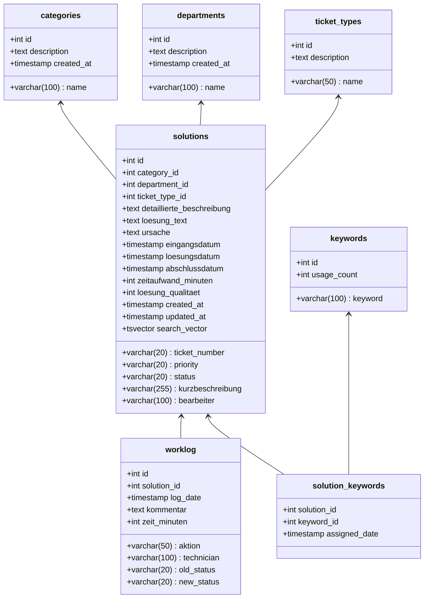

```mermaid
classDiagram
    direction BT

    solutions --> categories
    solutions --> departments
    solutions --> ticket_types
    solution_keywords --> solutions
    solution_keywords --> keywords
    worklog --> solutions

    class categories {
        +int id
        +varchar(100) name
        +text description
        +timestamp created_at
    }

    class departments {
        +int id
        +varchar(100) name
        +text description
        +timestamp created_at
    }

    class keywords {
        +int id
        +varchar(100) keyword
        +int usage_count
    }

    class solution_keywords {
        +int solution_id
        +int keyword_id
        +timestamp assigned_date
    }

    class solutions {
        +int id
        +varchar(20) ticket_number
        +int category_id
        +int department_id
        +int ticket_type_id
        +varchar(20) priority
        +varchar(20) status
        +varchar(255) kurzbeschreibung
        +text detaillierte_beschreibung
        +text loesung_text
        +text ursache
        +timestamp eingangsdatum
        +timestamp loesungsdatum
        +timestamp abschlussdatum
        +varchar(100) bearbeiter
        +int zeitaufwand_minuten
        +int loesung_qualitaet
        +timestamp created_at
        +timestamp updated_at
        +tsvector search_vector
    }

    class ticket_types {
        +int id
        +varchar(50) name
        +text description
    }

    class worklog {
        +int id
        +int solution_id
        +timestamp log_date
        +varchar(50) aktion
        +text kommentar
        +varchar(100) technician
        +int zeit_minuten
        +varchar(20) old_status
        +varchar(20) new_status
    }
```